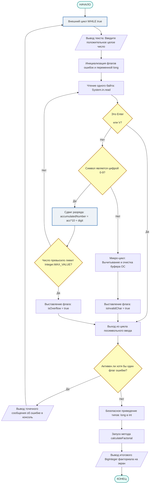

# Кастомный парсер консольного ввода и вычисление факториала (Java)

Программа реализует безопасный, посимвольный разбор входного потока данных `System.in.read()` без использования буферизированных оберток. Алгоритм защищен от зависания консоли, ввода некорректных символов (букв, спецсимволов), пустых строк и переполнения разрядной сетки типа данных `int`. При успешном вводе вычисляется точный факториал числа с помощью класса `BigInteger`.

## 📈 Блок-схема алгоритма работы программы

## 🛠️ Описание ключевых этапов алгоритма

1. **Изоляция мусора (Очистка буфера ОС):** При обнаружении нечислового символа во входном потоке, программа запускает внутренний цикл вычитывания байт `while (System.in.available() > 0)`. Это предотвращает бесконечный спам ошибками и очищает консоль для нового ввода.
2. **Флаговая верификация:** Вместо тяжелого механизма исключений (`try-catch`), для валидации пользовательских ошибок применяются примитивные логические маркеры (`isInvalidChar`, `isOverflow`, `isNegative`, `hasDigits`).
3. **Защита от переполнения:** Накопление числа происходит в типе данных `long`. Проверка на превышение `Integer.MAX_VALUE` срабатывает до приведения типов, гарантируя, что программа не получит искаженное отрицательное число на выходе из парсера.
4. **Безопасный лимит:** В бизнес-логику встроен программный предохранитель `N <= 30000`, защищающий оперативную память ПК от критической ошибки нехватки ресурсов `OutOfMemoryError` при расчете сверхбольших `BigInteger`.
